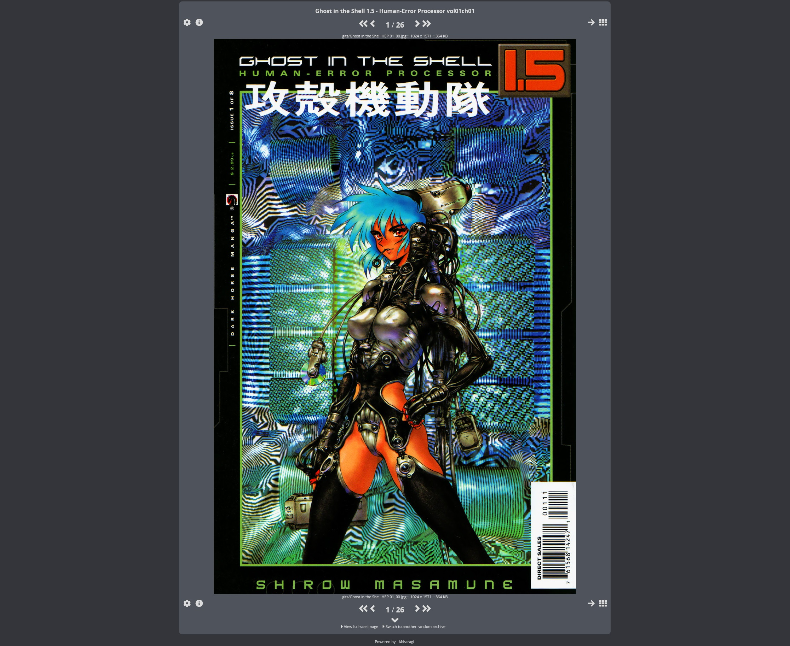
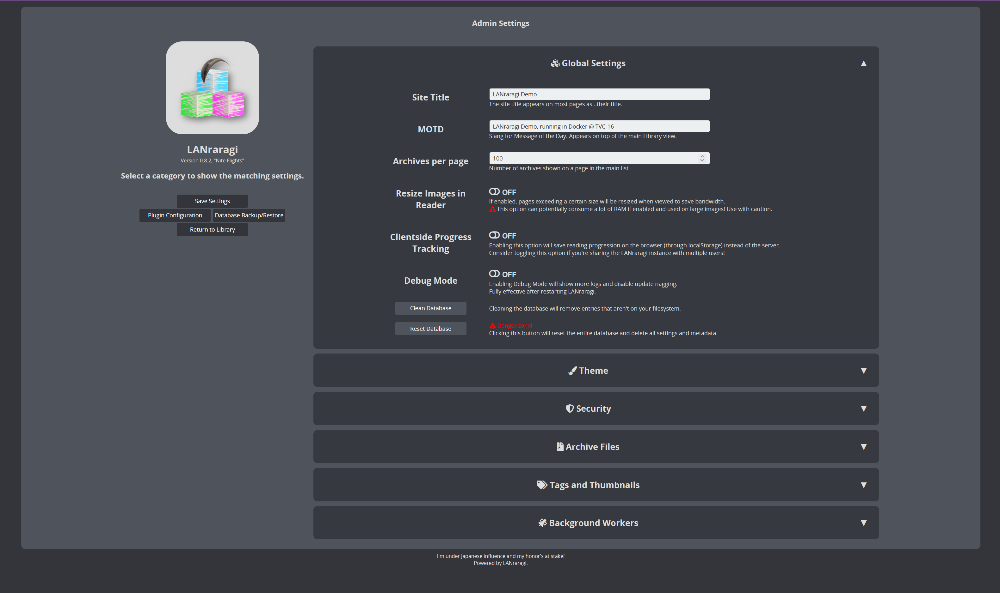
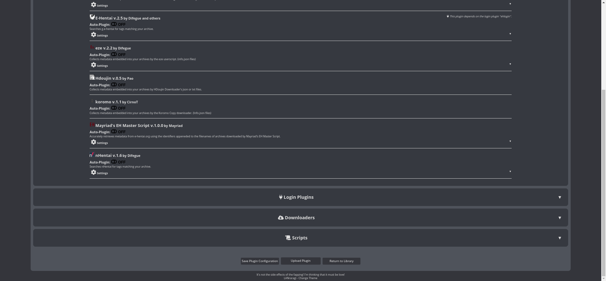

  
  
LANraragi
===========

Open source server for archival of comics/manga, running on Mojolicious + Redis.

#### 💬 Talk with other fellow LANraragi Users on [Discord](https://discord.gg/aRQxtbg) or [Github Discussions](https://github.com/Difegue/LANraragi/discussions)  

####  [📄 Documentation](https://sugoi.gitbook.io/lanraragi/) | [⏬ Download](https://github.com/Difegue/LANraragi/releases/latest) | [🎞 Demo](https://lrr.tvc-16.science) | [🐱‍👓 Windows Nightlies](https://nightly.link/Difegue/LANraragi/workflows/push-continous-delivery/dev) | [💵 Sponsor Development](https://ko-fi.com/T6T2UP5N)  

## The 2021 User Survey results have landed! 

Check [here](https://tvc-16.science/lrr-survey-3-results.html) for more info.

## Screenshots  
 
|Main Page, Thumbnail View | Main Page, List View |
|---|---|
|  |  |

|Archive Reader | Reader with overlay |
|---|---|
|  |  |

|Configuration | Plugin Configuration |
|---|---|
|  |  |

## Features  

* Stores your comics in archive format. (zip/rar/targz/lzma/7z/xz/cbz/cbr/pdf supported, barebones support for epub)  

* Read archives directly from your web browser: the server reads from within compressed files using temporary folders.

* Read your archives in dedicated reader software using the built-in OPDS Catalog

* Use the Client API to interact with LANraragi from other programs

* Two different user interfaces : compact archive list with thumbnails-on-hover, or thumbnail view.

* Choose from 5 preinstalled responsive library styles, or add your own with CSS.  

* Full Tag support with Namespaces: Add your own or import them from other sources using Plugins.  

* Store archives in either arbitary or dynamic Categories to sort your Library easily

* Import metadata using Plugins automatically when archives are added to LANraragi.

* Download archives from the Internet directly to the server, while using the aforementioned automatic metadata import

* Backup your database as JSON to carry your tags over to another LANraragi instance.

## Make a PR, get stickers™  

Merged PRs to this repo(or $5+ donations) are eligible to get a dumb sticker pack [shipped on the house.](https://forms.office.com/Pages/ResponsePage.aspx?id=DQSIkWdsW0yxEjajBLZtrQAAAAAAAAAAAAN__osxt25URTdTUTVBVFRCTjlYWFJLMlEzRTJPUEhEVy4u)  
