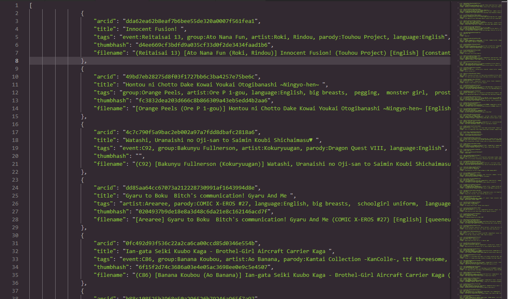

# Backup and Restore

_You do make backups, right?_

This page, available from the top menu once logged in, allows you to backup the entire database to a JSON file.  
This includes, for every file:

* The unique ID of the archive \(For the more technologically-enclined: LRR uses a SHA-1 hash of the first 500KBs of the file as the ID\)
* The saved tags  
* The saved title  

This JSON can then be restored in another LRR instance, if it has archives with matching unique IDs.


You can also make backup JSONs with the `npm run backup-db` command or through the Client API.


