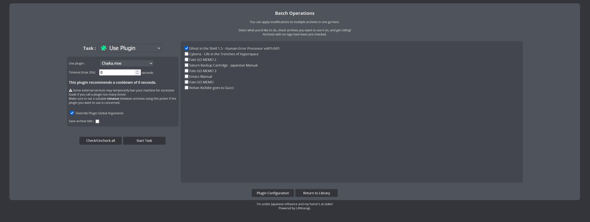

# 🦇 Batch Operations

It's a pretty common occurence: You imported archives without enabling automatic tagging, or you suddenly want to add tags to a lot of archives at once.

Editing tags manually for each file ain't gonna cut it...

Enter **Batch Tagging**, allowing for laser-focus, one-time operations over large sets of archives.

All your archives are shown in the checklist on the right, with archives with no tags pre-checked for ease of access.

Past that, it's just a matter of selecting what you want to do, optionally plugging in special arguments for the run, and going ham on batching!  

The currently available operations are:  
- **Use Plugin**: Use a plugin on the selected archives. The arguments available for overriding will depend on the plugin.
- **Apply Tag Rules**: Apply your default [Tag Rules](./tag-rules.md) to the selected archives.
- **Clear New**: Remove new flag from selected archives.
- **Delete**: Delete the selected archives.


As shown in the screenshot, you can only override **Global Arguments** in Batch Tagging.

One-shot arguments, such as specifying a E-Hentai URL, are only available when editing a single archive through the classic Edit menu.


If you set a timeout value, the batch session will wait the specified time between archives.

While a batch session runs, you get a live summary of what the server is doing, and can cancel at any time.
