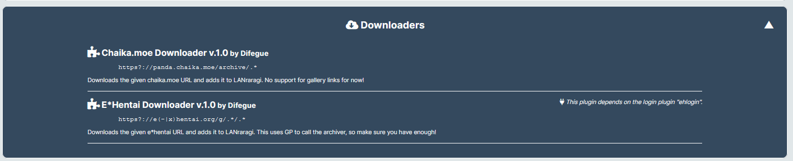
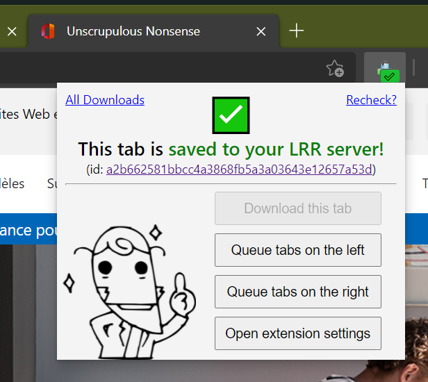

# ⬇ Downloading Archives

Starting with version 0.7.3, LANraragi can directly download URLs to its content folder.  
This allows you to seamlessly add archives from the Internet to your LRR instance for safekeeping.

By default, we will try to download any URL you chuck at us! This will mostly work for simple URLs that point directly to a file we support.  
(For example, something like this very nice Quake booklet: `https://archive.org/download/quake-essays-sep-15-fin-4-graco-l-cl/QUAKE_essays_SEP15_FIN4_GRACoL_CL.pdf` will download without a fuss.)


Downloaded archives will automatically get a `source:` tag with the URL they were downloaded from.  
Said source tags can often be used with compatible Metadata plugins to fetch metadata precisely. (Supported by E-H and nH)


For non-direct links, you will need to have a matching **Downloader Plugin** configured.  
LANraragi currently ships with Downloaders handling E-H and Chaika links.


Just like with Metadata plugins, Downloaders might require using a matching **Login Plugin** to authenticate to the remote website.


## Browser Extension

You can also install the [Tsukihi Browser Extension](https://github.com/Difegue/Tsukihi) to automatically verify/download URLs you browse to your server instance.

