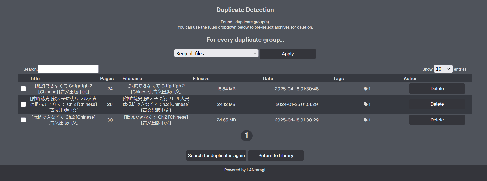

# 👯 Duplicate Detection

Duplicate Detection is available through the shorcut link at the top of the Index.  

  

This feature looks at archives across your database to try and find duplicates by comparing cover thumbnail hashes.  
Once dupes have been found, you can automatically keep the better file using a few preset rules looking at archive size/date.  

To use it, first start a scan by clicking "Search for duplicates", and wait for the scan to conclude.  

If any groups of potential duplicates were found, they'll be listed in the UI. You can then apply a blanket decision on every group, or look at them on a case-by-case basis.  


If you want a more powerful duplicate detector on Windows, consider using the one built into [LRReader](./external-readers.md).

