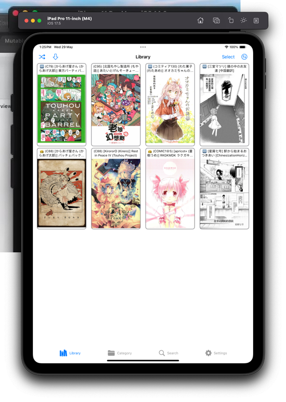
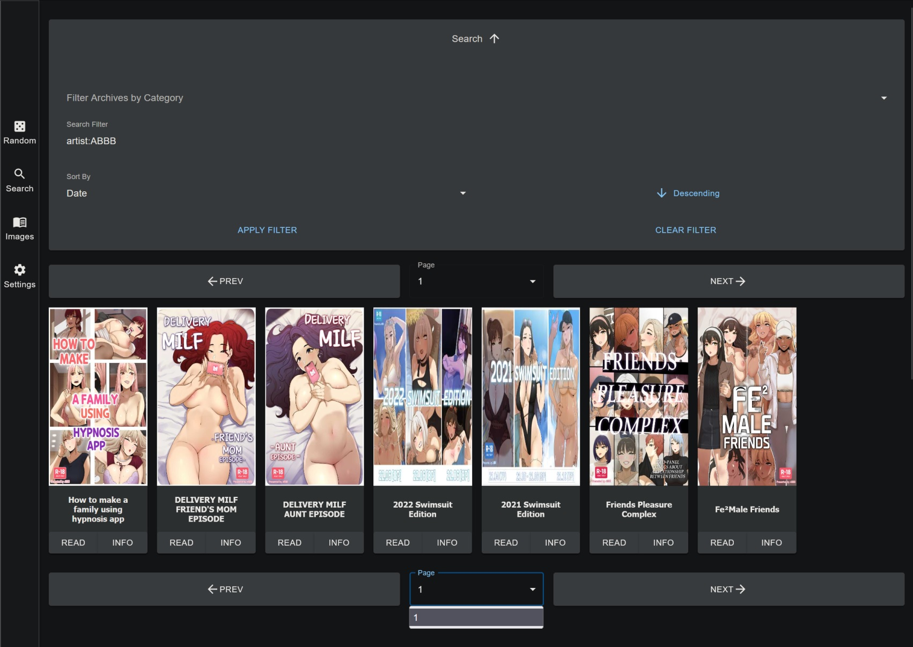

# 📱 Using External Readers

If the built-in Web Reader is not enough for you, LANraragi's content can be consumed by multiple external applications who provide their own readers.

## Dedicated LANraragi readers

Dedicated LANraragi readers use the Client API to provide an experience closely matching the capabilities of the Web interface.

Here are some existing clients:

### [Ichaival (Android)](https://github.com/Utazukin/Ichaival)

[Download it here.](https://github.com/Utazukin/Ichaival)\

**Features:**

* View and search your LANraragi database
* View tags
* Read archives
* Bookmark archives to keep track of your current page
* Sort archives by date (requires Timestamp tags to be enabled)

### [DuReader (iOS)](https://github.com/Doraemoe/DuReader)

[Download it here.](https://github.com/Doraemoe/DuReader)\

### [LRReader (Windows 10)](https://github.com/Guerra24/LRReader)

[Download it here.](https://github.com/Guerra24/LRReader)\

**Features:**

* Archives list.
* Search.
* Archive overview and reader.
* Bookmarks.
* Multiple servers/profiles.
* Manage your server from within the app.

### Tachiyomi reader

The open-source [Tachiyomi](https://tachiyomi.org) Android reader has a readymade plugin to consume the LANraragi API.  
You can download it [here.](https://github.com/tachiyomiorg/extensions/blob/repo/apk/tachiyomi-all.lanraragi-v1.4.15.apk)  

### LRR React Web

A React-based frontend PWA making use of the Client API. "Works best on mobile and tablet viewports, but the desktop experience is okay."  
Check it out [here.](https://github.com/hibikikuze4dan/lanraragi-react-web)

## Generic OPDS readers

Some readers can leverage the [OPDS Catalog](https://opds.io) exposed by LANraragi to visualize and read the available archives.  
Those programs can't exploit all of LRR's features(Search, Database backup), but they might have reading features you won't find in the current dedicated clients.  

If your OPDS reader supports [Page Streaming Extensions](https://anansi-project.github.io/docs/opds-pse/intro), LANraragi is compatible with it and will serve individual pages.  


LRR supports OPDS PSE 1.1, which means that if you have server-side progress tracking enabled, you can pick up where you stopped reading from any OPDS client. Syndication!


The URL for the OPDS Catalog is `[YOUR_LANRARAGI_URL]/api/opds`.  
You can use [the Demo](https://lrr.tvc-16.science/api/opds) as an example.  
Refer to your reader's documentation to figure out where to put this URL.


If you have No-Fun Mode enabled, remember that you'll need to add the API Key to this URL for the catalog to be available to your reader application.  
You can either use the `Bearer` token approach like with regular API calls, or add `?key=[API_KEY]` as a parameter to the URL.



The following readers have been tested with the OPDS Catalog:

* [**Moon+ Reader (Android)**](https://play.google.com/store/apps/details?id=com.flyersoft.moonreader)
* [**Librera Reader (Android)**](https://librera.mobi)
* [**Challenger Comics Viewer (Android)**](https://play.google.com/store/apps/details?id=org.kill.geek.bdviewer)
* [**AlfaReader (Windows 7/8/10)**](https://www.alfareader.org)

The following readers haven't been tested but should work:

* [**TiReader (iOS)**](http://tireader.com)
* [**Chunky Reader (iOS)**](http://chunkyreader.com)
* [**Panels (iOS)**](https://panels.app/)
