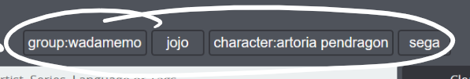

# Categories

Categories appear in the archive index as shortcut buttons.  

 There are two distinct kinds:

*  📁 Static Categories are arbitrary collections of Archives, where you can add as many items as you want.
*  ⚡ Dynamic Categories contain all archives matching a given predicate, and automatically update alongside your library.

Toggling a category in the index will restrict all your searches to that category, for as long as it is toggled.

\[Image here\]

To create categories, you can use the dedicated setting page in the app:

\[image here\]


If you have an existing folder hierarchy for your Archives, LRR can automatically create categories from said hierarchy through the dedicated utility Script. 

Look for it in Plugin Configuration.


