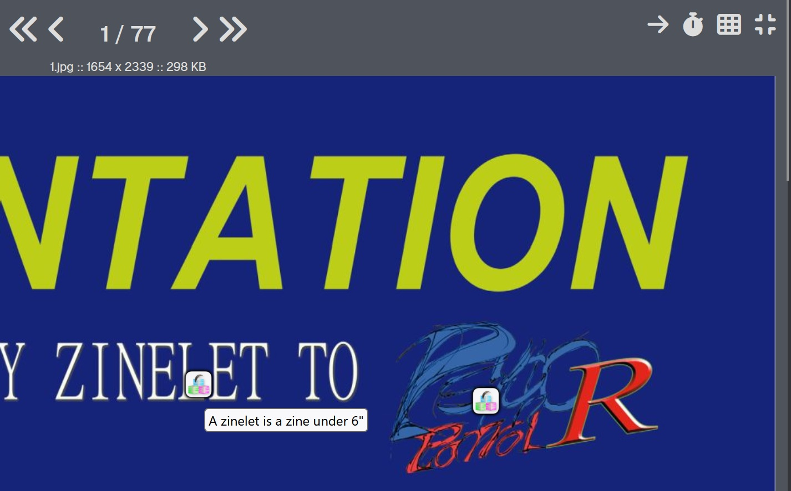

# 💮 Stamps

Stamps allow you to attach arbitrary text to a specific position within an Archive's pages.  
If you've ever used Danbooru's translation overlay feature, that's the closest equivalent.  

Stamps are set and viewed through the Web Reader interface exclusively. You can enable them by toggling on the matching option:  

  

At any time, press "S" in the Reader to enter Stamp mode. Then, just click where you want to place the Stamp, and type in your data.  

  

Stamps will show as the server icon, with their text as a tooltip.  
You can reposition a Stamp at any time by dragging it across the page.  

Right-clicking a Stamp will allow you to edit its text or delete it.  
