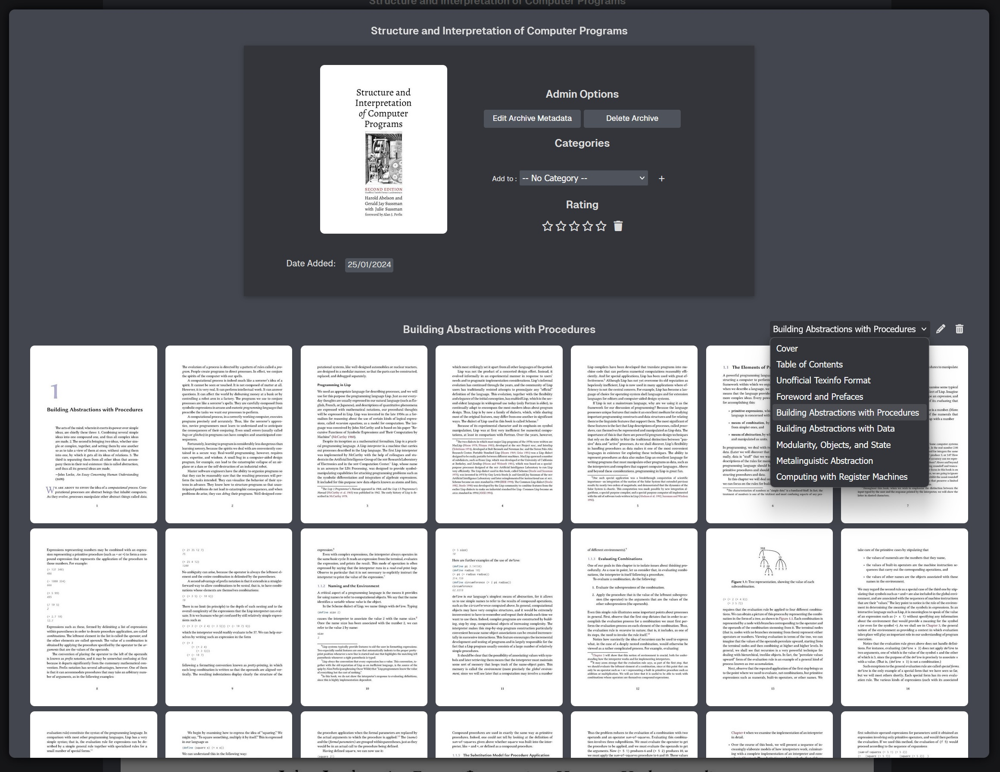
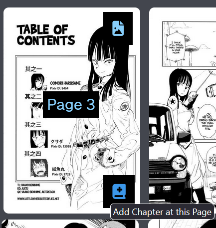
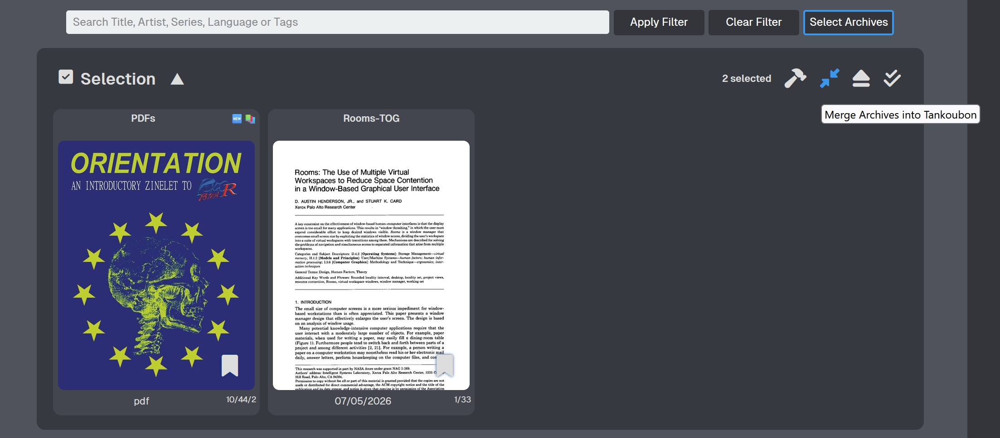
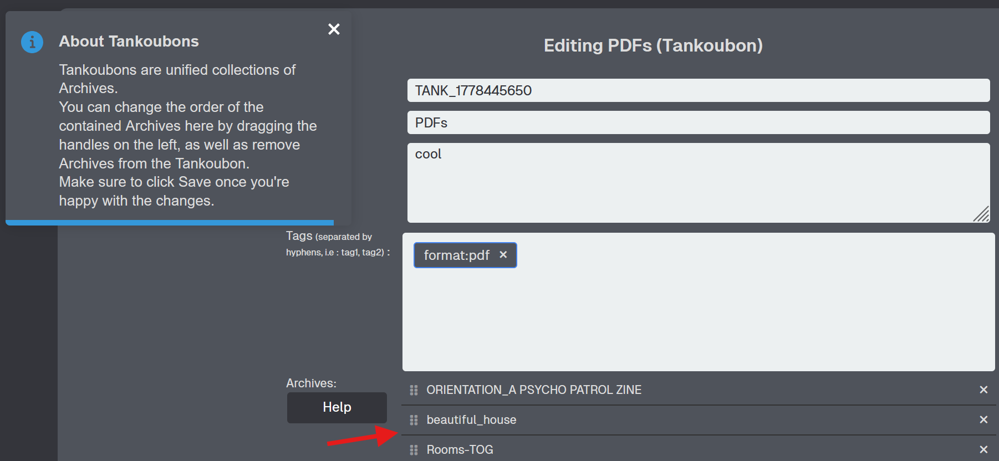
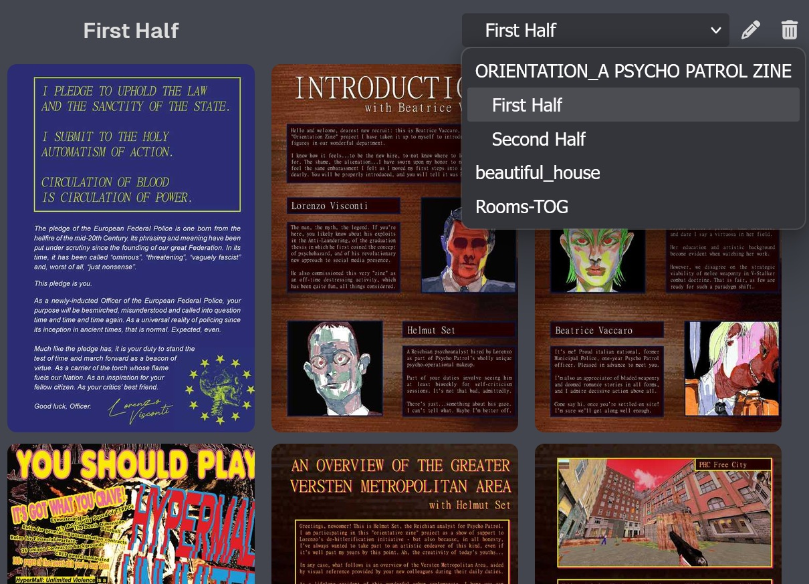

# 🗜️ Merging and Splitting Archives  

Depending on where your collection comes from, you might have:  

- A series spread out across multiple files on your server, one per chapter/volume/etc
- Individual Archives with a very large page count where you'd like to set breakpoints at each chapter

LANraragi offers functions to help with organizing these types of files, by both splitting them up (Chapters) or merging them (Tankoubons).  

## Splitting an existing Archive into Chapters  

Chapters are _virtual_ delimiters within an Archive that allow you to split it into multiple sets of pages when reading it.  

  

They're exclusively set and accessed within the Web Reader's pages overlay.  
To **create** a Chapter, simply click the matching button on the page you want to start it at, and enter a name.  
  

If you create your first Chapter at a page higher than 1, a matching _Untitled Chapter_ will be created to fill the gap.  
For example, if you create "Chapter X" at page 20 in a 50-page Archive, the list will look like the following:  

- Untitled Chapter: p1-p19  
- Chapter X: p20-p50  

## Merging multiple Archives into a Tankoubon

**Tankoubons** are a special type of Archive that regroups multiple Archives within them in a user-specified order.  
Basically, you can select multiple Archives in your collection, and **merge** them into a single element to show in your Index/Library instead.  


This does **not** modify the physical files in any fashion. Tankoubons are a database-only thing.  


To create a Tank, use the Selection mechanism like with [Batch Operations](./batch-tagging.md), but click the "Compress" icon instead of the Hammer.  

  

The underlying Archives will be removed from search results, and the Tankoubon will show in their place.  
Tankoubons inherit metadata (Tags/Stamps) from their sub-Archives by default.  

However, you can add **additional metadata** to a Tankoubon by opening it in the Edit metadata page. That's also where you can reorder the sub-Archives if desired, or drill down to edit the metadata of the sub-Archives individually.  

  


Tankoubons will collate tags from every sub-Archive, but not their Summaries.  
If you want your Tankoubon to have a summary, you'll have to set one manually when editing its metadata.  


Tankoubons will show their individual sub-Archives in the same dropdown list as Chapters.  
If any of the sub-Archives have Chapters of their own, the dropdown can then show 2 levels of hierarchy.  
  


Deleting a Tankoubon will not affect the sub-Archives in any way; They'll just become visible in search results again.  

However, any Tankoubon-specific metadata will be lost! Be careful when editing Tanks.  
If the sub-Archives are deleted from the server manually, the Tankoubon will remain in the database regardless. (Even if it gets to 0 Archives)  

