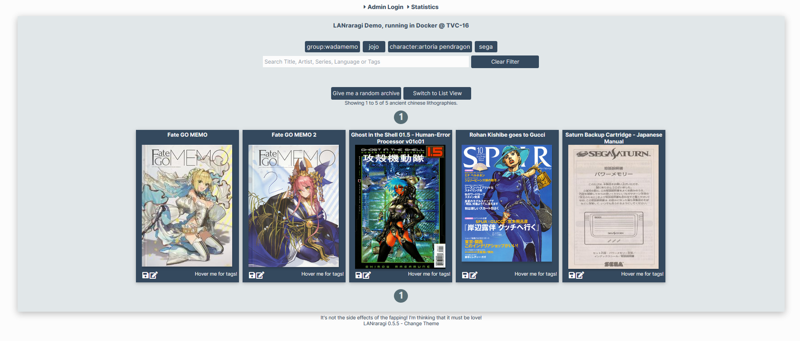
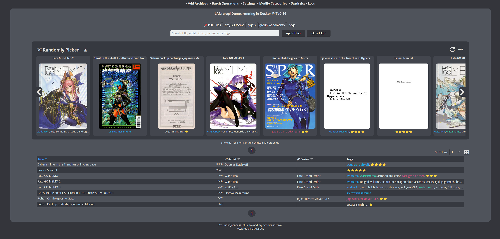
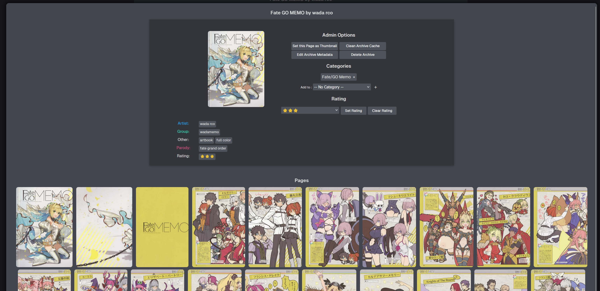

# 📚 Reading Archives

## Using the Archive Index

The main page will show all the Archives loaded into the application, sorted by name.

You can customize display options to show the index in compact mode, as well as add extra namespaces and select which namespaces to show in said columns.

The topmost **carousel** view will show random archives from your current search in both thumbnail and compact modes -- It can also be configured to show New or Untagged archives instead.


Don't forget you can **right-click** archives to show a context menu, allowing you to edit/download/delete them, or to add them to a category.


When reading an archive, it is automatically extracted to a temporary folder.\
This folder is then simply loaded into the built-in Web Reader.\
The temporary folder will clean up on its own when it reaches a large enough size, so there's no need to worry about your disk filling up over time.

## Web Reader Options

In the reader, you can use the keyboard arrows or the built-in arrow icons to move from page to page.\
You can also simply click the right or left side of the image.\
When reading an archive, various features are available to you with the side button controls — Feel free to hover over them to see what options are available.

You can click the help icon on the left side of the Reader to get a quick refresher about its controls.\
The cog/Reader Options button shows the various options you can toggle to change the reading experience. (Double page, Japanese read order, etc.)

The Page Overlay button (also actionable by pressing **CTRL**) will show all the pages of the current archive, allowing for quick navigation and preview.

  

The overlay is also where you can filter pages to only show pages with [Stamps](../advanced-usage/stamps.md), and jump to a different [Chapter](../advanced-usage/tankoubons-and-chapters.md) if your Archive has any.  

  

The Reader comes with its own set of clientside options to customize the reading experience as you want.

If "Progression Tracking" is enabled, when you close and reopen the archive, it'll show you the page you last stopped at.

## Non-Web Reader (Third-Party applications)

If you want to use a third-party application to read your archives, you can use the software listed in the following page:


[external-readers.md](../advanced-usage/external-readers.md)

