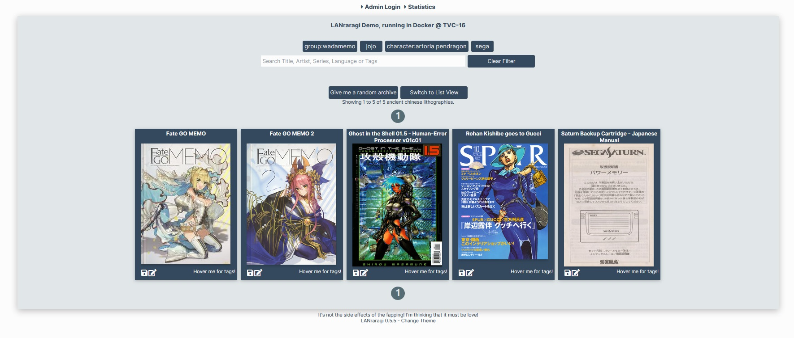

# Reading Archives

## Using the Archive Index

The main page will show all the Archives loaded into the application.

When reading an archive, it is automatically extracted to a temporary folder.  
This folder is then simply loaded into the built-in Web Reader.  
The temporary folder will clean up on its own when it reaches a large enough size, so there's no need to worry about your disk filling up over time.

## Web Reader Options

In the reader, you can use the keyboard arrows or the built-in arrow icons to move from page to page.  
You can also simply click the right or left side of the image.  
When reading an archive, the three button icons on the rightside of the page offer various options.

You can click the information icon on the right-side of the Reader to get a quick refresher about its controls.  
The Reader Options button shows the various options you can toggle to change the reading experience. \(Double page, Japanese read order, etc.\)

The Page Overlay button \(also actionable by pressing **CTRL**\) will show all the pages of the currently opened archive, allowing for quick navigation and preview.

Automatic bookmarking is also present: When reopening the archive, it'll show you the page you last stopped at.

## Non-Web Reader \(Third-Party applications\)

Non-Web Readers are not officially supported, but you can build your own through the Client API.



Here are some existing clients:

* [Ichaival \(Android\)](https://github.com/Utazukin/Ichaival)  
* Tsukihi \(Windows/macOS\)

