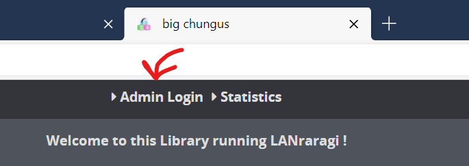

# Getting Started

## Quick To-Do List for newcomers

* [ ] Change Security Settings
* [ ] Change default Content folder location
* [ ] Enable and configure wanted Plugins
* [ ] Enable Auto-Tagging on upload if needed
* [ ] Start uploading Archives!


If you want to change the used Redis address/database \(If you don't know what that means, you don't want to\), you can do so by editing the _lrr.conf_ file at the root of the app folder.


## Security

The first step you'll probably do is head to the Configuration page to modify the default security settings.

When logged in as Admin in LRR, you have access to the full functionalities of the app. By default, unlogged users can only **read** archives.

There are three basic levels of security you can enable:

| Security Level | Reading Archives | Public API | Editing Metadata | Change Settings |
| :---: | :---: | :---: | :---: | :---: |
| Password Disabled | ✅ | ✅ | ✅ | ✅ |
| Password Enabled \(default\) | ✅ | ✅ | ❌ | ❌ |
| No-Fun Mode | ❌ | ❌ | ❌ | ❌ |

If you're running the app on a server that's potentially accessible by others, I recommend leaving password protection enabled and changing the default password.

If you don't want any page of the app to be accessible to outsiders, you should enable No-Fun Mode **and restart the application** to make sure it is enabled.


If you enable No-Fun Mode, you'll have to set an **API Key** to be able to use the Public API methods. See more information in the API page.


## Content Folder

One of LRR's core concepts is the **content folder.**  
This folder contains all the user-generated data:

* Archives \(in zip/rar/targz/lzma/7z/xz/cbz/cbr format\)  
* Thumbnails for said archives
* The Redis database \(Unless you're running from source\)  

By default, this folder is placed at the root of the LRR installation, but you can configure it to use any folder on your machine instead. The content folder is subdirectory-aware, so you can easily drop-in an already sorted collection.


If you plan on setting your content folder to a folder that already contains archives, you might want to enable **Plugin AutoTagging** beforehand, so that metadata will be fetched for your files as they're added. See the below section and the Metadata documentation for more info.

You can still do it afterwards on a per-archive basis.


## Plugin Configuration and AutoTagging

**Plugins** are used by LANraragi to fetch Metadata for your Archives using various online services.

Currently supported out of the box are:

* E-Hentai/Exhentai
* nHentai
* Chaika.moe
* .json files embedded into your Archives from the eze userscript
* .json files embedded into your Archives from HDoujin Downloader

See the Adding Metadata section for more information.



## Uploading Archives

You can add archives to the application by either copying them to the content folder, or using the built-in uploader tool.  
They'll be automatically indexed and added to the database.  
Plugins will also be ran automatically to try and fetch metadata for them, if you enabled Auto-Tagging previously.

