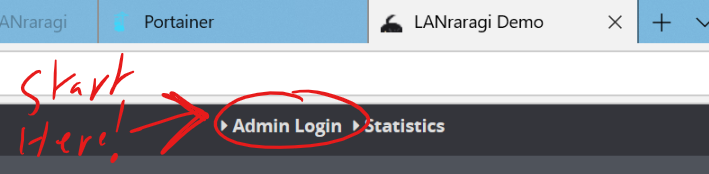

# Getting Started

## Quick To-Do List for newcomers

* [ ] Change Security Settings
* [ ] Enable and configure wanted Plugins to tag your content
* [ ] Change the default Content Folder to your personal folder, or start adding files to the default Content Folder!


If you want to change the used Redis address/database \(If you don't know what that means, you don't want to\), you can do so by editing the _lrr.conf_ file at the root of the app folder.


## Security

The first step you'll probably do is head to the Configuration page to modify the default security settings.

When logged in as Admin in LRR, you have access to the full functionalities of the app. By default, unlogged users can only **read** archives.

There are three basic levels of security you can enable:

| Security Level | Reading Archives | Public API | Editing Metadata | Change Settings |
| :---: | :---: | :---: | :---: | :---: |
| Password Disabled | ✅ | ✅ | ✅ | ✅ |
| Password Enabled \(default\) | ✅ | ✅ | ❌ | ❌ |
| No-Fun Mode | ❌ | ❌ | ❌ | ❌ |

If you're running the app on a server that's potentially accessible by others, I recommend leaving password protection enabled and changing the default password.

If you don't want any page of the app to be accessible to outsiders, you should enable No-Fun Mode **and restart the application** to make sure it is enabled.


If you enable No-Fun Mode, you'll have to set an **API Key** to be able to use the Public API methods. See more information in the API page.


## Content Folder

One of LRR's core concepts is the **content folder.**  
This folder contains all the user-generated data:

* Archives
* Thumbnails for said archives
* The Redis database \(Windows only\)  

By default, this folder is placed at the root of the LRR installation, but you can configure it to use any folder on your machine instead. The content folder is subdirectory-aware, so you can easily drop-in an already sorted collection.  

The content folder can be write-only if you so desire, but the caveat is that the thumbnail subfolder \(`/thumb`\) needs write rights to function properly for the time being.  
You can use a symbolic link if you want the thumbnail folder to be located somewhere else.  


The following formats are supported by LRR for Archives: 

* zip/cbz
* rar/cbr \(up to RAR4 only\)
* tar.gz
* lzma
* 7z
* xz
* pdf
* epub \(images only if viewed in the Web Client)\



If you plan on setting your content folder to a folder that already contains archives, you might want to enable **some Plugins** beforehand, so that metadata will be fetched for your files as they're added. See the Metadata documentation linked below for more info.

However, beware that if you enable plugins that depend on remote services, querying said services to scrap metadata for a large number of archives might lead to **temporary bans**!  
If you have a large number of archives (More than 500), you might want to ignore Automatic Plugin execution and use [Batch Tagging](../advanced-usage/batch-tagging) instead.  


## Plugin Configuration

**Plugins** are used by LANraragi to fetch Metadata for your Archives using various online services.

Currently supported out of the box are:

* E-Hentai/Exhentai
* nHentai
* Chaika.moe
* .json files embedded into your Archives from the eze userscript
* .json files embedded into your Archives from HDoujin Downloader
...and more!

See the Adding Metadata section for more information.



## Uploading Archives

You can add archives to the application by either copying them to the content folder, or using the built-in uploader tool.  
They'll be automatically indexed and added to the database.  
Plugins will also be ran automatically to try and fetch metadata for them, if you toggled them in **Plugin Configuration** previously.  

You can also **queue downloads** by giving URLs to the server in the uploader tool, which will then be downloaded to your content folder seamlessly.  
See the link below for more details.  

