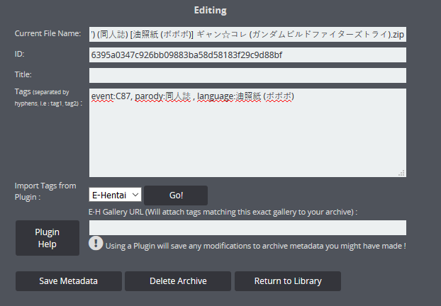

# ✒ Adding Metadata

## Editing an Archive manually

To use a plugin on a single archive, you need to access its **editing** page by clicking the pencil icon on the main view. From here, you can modify all metadata manually. Don't forget to save!


The "Delete Archive" button will permanently wipe the Archive from your filesystem!


## Using Plugins

LANraragi supports the use of **Plugins** to fetch tags for your archives.\
Said Plugins can be used in three different ways:

* On a per-archive basis through the standard Edit dialog
* Automatically on every newly added archive.
* During a Batch Tagging session.

For more info on Batch Tagging, check the following article:


[batch-tagging.md](../advanced-usage/batch-tagging.md)


To use plugins automatically, you have to first use the **Plugin Configuration** page to choose which plugins will be automatically executed, and set their options if they need any.

LRR ships with a few plugins out of the box, in the _/lib/LANraragi/Plugins_ folder.\
To install other Plugins (in .pm format), drag them to this folder and they'll appear in Plugin Configuration.

You can also install Plugins through the "Install Plugin" button in Plugin Configuration.\
This feature requires Debug Mode to be enabled for security purposes. Debug Mode can be disabled once you're done installing Plugins.


Plugins have as much control over your system as the main LANraragi application does!

When installing Plugins from unknown sources, do a little research first.

