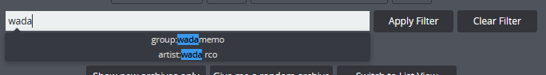

# 🔎 Searching the Archive Index

The search bar in LANraragi tries to not be too dumb and will actively suggest tags to you as you type.

You can also use the following special characters in a search:

**Quotation Marks ("...")**\
Exact string search. Allows a search term to include spaces. Everything placed inside a pair of quotation marks is treated as a singular term. Wildcard characters are still interpreted as wildcards.

**Question Mark (?), Underscore (\_)**\
Wildcard. Can match any single character.

**Asterisk (\*), Percentage Sign (%)**\
Wildcard. Can match any sequence of characters (including none).

**Subtraction Sign (-)**\
Exclusion. When placed before a term, prevents search results from including that term.

**Dollar Sign ($)**\
Add at the end of a tag to perform an exact tag search rather than displaying all elements that start with the term. Only matches tags regardless of search parameters and can be used as an exclusion to ignore misc tags in the search query.
