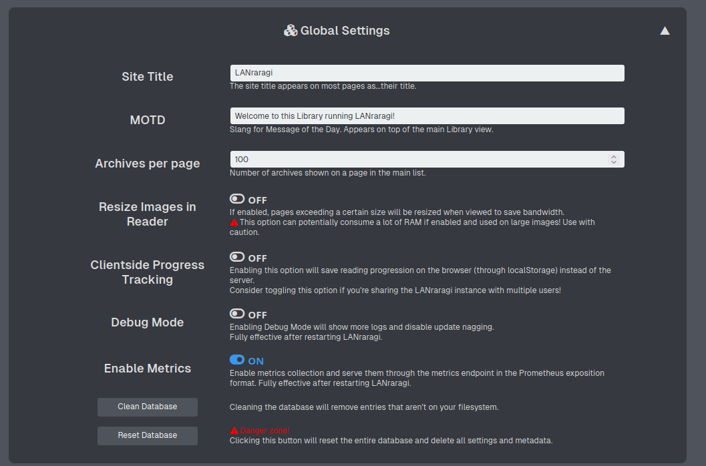

# 📈 Statistics and Logs

## Statistics

This page shows basic stats about your content folder, as well as your most used tags.

## Logs

This page allows you to quickly see logs from the app, in case something went wrong.  
If you enable _Debug Mode_ in Configuration, more logs will be displayed.


If you enable Debug Mode for troubleshooting purposes, make sure to disable it once you're done!


## Metrics

LANraragi supports exporting server metrics via the `/api/metrics` endpoint in the text-based
Prometheus exposition format, allowing you to see server analytics and trendlines using a
Prometheus/Grafana stack.

The `/api/metrics` endpoint is disabled by default. To enable this feature, go to the "Global 
Settings" configuration and toggle on "Enable Metrics". Then, restart the server.

Supported metrics include:

* Number of total archives and workers
* Number of requests handled and total request handling duration for a given endpoint and worker
* CPU, memory and file-descriptor statistics
* Miscellaneous server info (version, version name)


Due to the metrics exporter relying on Redis as its shared memory store, the collection process may
apply a high write pressure to the database which can overwhelm its
[default persistence configurations](https://redis.io/docs/latest/operate/oss_and_stack/management/persistence/#snapshotting).

