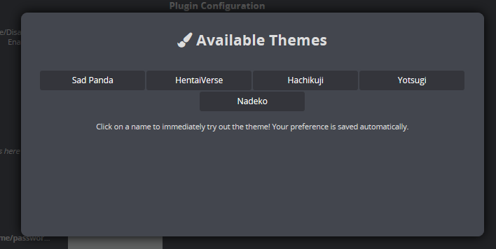

# 🖌️ Themes

The front-end interface of LANraragi is customizable out of the box through CSS.\
A few themes are built-in already. Theme Preference is saved server-wide and will be shown to all users.

Changing Themes can be done alongside all the other app settings.\
You can write your own themes by modifying the existing ones - Dropping them in the _/public/themes_ folder will make them appear in the selection.  

While optional, you can also add a preview thumbnail for your theme in _/public/img/theme_preview_.  


For users who don't have access to the app folder and want to make custom themes, your only option currently is to use a custom CSS browser extension.\
Docker users can try binding a folder on their machine to the _/home/koyomi/lanraragi/public/themes_ folder.

