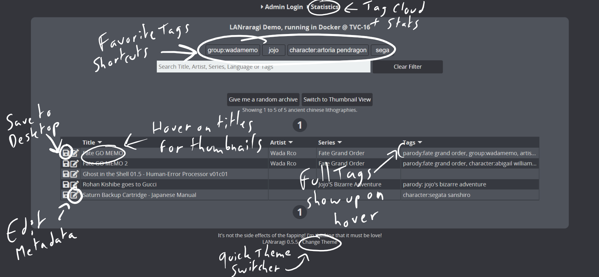

# Favorite Tags

In Configuration, you can set five tags as your **favorites**.  
They'll appear in the archive index as shortcut buttons, which you can toggle to instantly perform a search for said tag.  
Toggling multiple buttons at once is an OR operation, not an AND -- Selecting _jojo_ and _touhou_ will give you archives containing one or both of those tags.


If you do want AND searches in your favorites, you can do so using a quick regex:  
`jojo.*touhou` for instance, will only search for archives containing both those tags.


