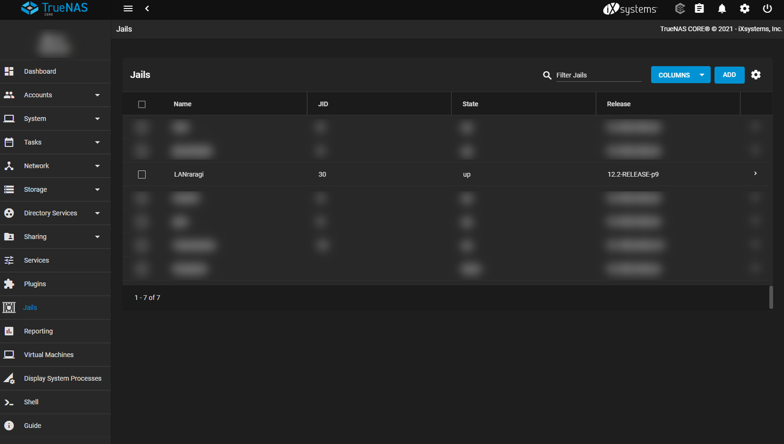
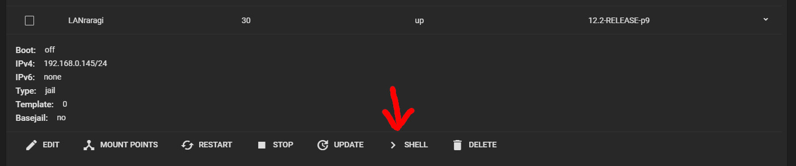
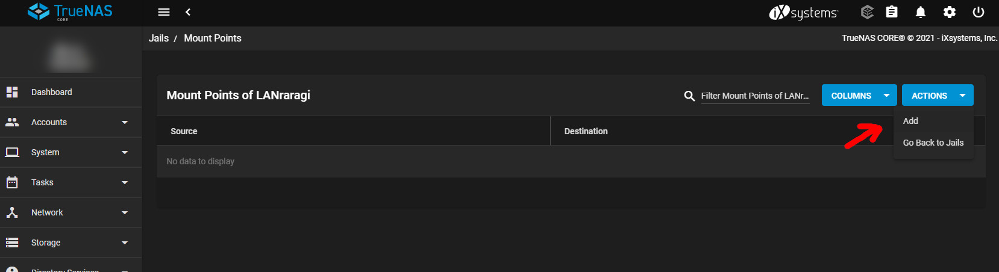

# FreeBSD / Jail

Installing LANraragi on FreeBSD or in a jail is similar to [installing it from source](https://sugoi.gitbook.io/lanraragi/installing-lanraragi/source) with slighly altered dependecies and some extra steps.

## Jail creation

For creating the jail on a regular FreeBSD installation, refer to its [documentation](https://docs.freebsd.org/doc/7.3-RELEASE/usr/share/doc/handbook/jails-build.html).

For creating the jail on FreeNAS, simply navigate to the jails tab in the webui and click on 'add'.



After creating the jail enter it, type ```pkg``` and confirm the next prompt.



If you want to install it on the main system itself (which in most cases is not recommended) you can simply skip this step.

## Installing dependencies

It is recommended that you first check/install all neccessary dependecies. 
Although you can also go along with the installation and fix any critical dependency errors along the way. This will decrease installation size, but most likely result in issues later on.

```sh
pkg update
pkg upgrade
pkg install gnupg
pkg install p5-App-cpanminus
pkg install redis
pkg install libarchive
pkg install ImageMagick7
pkg install libressl
pkg install npm
pkg install p5-mojolicious
pkg install git
cpan Parallel::Loops
```


If you want to configure your jail a little bit leaner you can install the noX11 version of ImageMagick and other dependencies if available.


Afterwards, you need to add redis_enable="YES" to your `rc.conf` with your text editor of choice. The preinstalled one is Easy Editor (`ee`), but you can install `nano` as well.

```ee /etc/rc.conf```
 
 
You need to restart the jail now so that the changes can take effect (Keep in mind to cd back into your LANraragi folder afterwards or you will have to use the full filepath for the following commands).


## Installing LANraragi

This step is effectively the same as when [installing from source](https://sugoi.gitbook.io/lanraragi/installing-lanraragi/source). 
Depending on how you have built your jail you might already have a place to put your installation, else I recommend conforming to Unix standards.

```sh
mkdir /usr/local/etc/LANraragi
cd /usr/local/etc/LANraragi
git clone -b master http://github.com/Difegue/LANraragi /usr/local/etc/LANraragi
npm run lanraragi-installer install-full
```

After the installer completed you can go ahead and ```npm start```

You might get an error thrown in on your first startup. It does not appear to affect LANraragi and does not appear on subsequent startups, so do not worry too much about that one too much.

Now you can switch over to any device in your network and test if LANraragi is working properly by accessing your_configured_ip:3000

You will need to keep the console open during that. If you close it now LANraragi stops as well. We will take care of that in the next step.
After checking if everything works you can close down LANraragi either by pressing crtl+C in your console or simply closing the console window.

## Setting up LANraragi as Daemon

Now we are setting up LANraragi to autostart when starting the jail. That way it will also keep running until you stop the jail entirely.

```sh
ee /usr/local/etc/LANraragi/lrr
```

```text
#!/bin/share/doc/handbook/jails-build
lrr_start()
{
	user='root'
	cd /usr/local/etc/LANraragi
	su ${user} -c "/usr/local/bin/npm start /usr/local/etc/LANraragi/"
}


lrr_start
```

```sh
ee /etc/rc.d/lrrd
```

```text
#!/bin/sh
. /etc/rc.subr

name="lrr"
rcvar=`lrrd_enable`
command="/usr/local/etc/LANraragi/${name}"

run_rc_command "$1"
```

Now LANraragi should run as a service.

## Mountpoints

In many setups, jails are running on fast but small drives while the bulk of data is offloaded somewhere else. If you are running a similar config you might want to consider offloading your content and tmp folders from your SSD to your HDDs with the help of mountpoints.



## Updating

Updating works the same as when installing from source [installing from source](https://sugoi.gitbook.io/lanraragi/installing-lanraragi/source#updating).  


By default, LRR listens on all IPv4 Interfaces on port 3000, unsecured HTTP.

