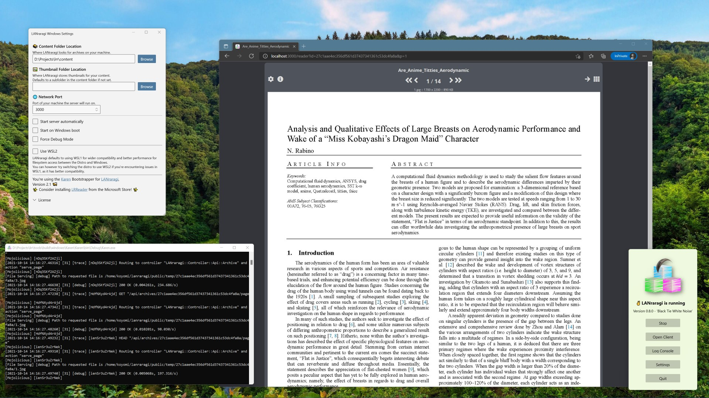

# ❓ Which installation method is best for me?

As LRR is a server app first and foremost, its setup is a bit more complex than your usual Desktop application.  
However, a lot of work as been done behind the scenes to make it easy!

Look at the methods below for something that fits your OS and usage.

## macOS: _Homebrew_

[Homebrew](https://brew.sh) allows you to quickly setup LRR on macOS without relying on containers or modifying your preinstalled system libaries.



[macos.md](macos.md)


## Windows 10/11: _LRR for Windows_


This method works on **64-bit** editions of Windows 10 only.

Since LRR 0.8.0, you need Windows 10 version _1903_ at least. 0.7.9 will work with version _1809_ if you're on an LTSC channel.  
If you still want to use further server versions on 1809, a step-by-step workaround is available on the Windows documentation page below.  




I provide a dedicated installer for Windows machines as of 0.6.0, complete with a GUI and autostart.


[windows.md](windows.md)


## Linux/macOS/Windows 10: _Docker_

Taking a page from sysadmin books, you can easily install LRR as a **container** with Docker.  
They're lightweight, easy to update, and automatically built/tested. I recommend this for NAS setups!


[docker.md](docker.md)


## Linux/macOS: _Installing from Source_

Installing from **source** is a more involved procedure, but it does put you in full control and able to hack up the app's files as you wish.


[source.md](source.md)


## Linux/Community: _Community provided install packages_

Ready-to-install packages provided by voluntary maintainers or by a linux distribution itself.


[community.md](community.md)


## FreeBSD/Jail

Similar to installing from source with an altered process for FreeBSD compatability.


[jail.md](jail.md)


## Older Windows: _Legacy Docker Toolbox or Vagrant_


At this point the only solutions I have to give you are basically glorified VMs.

You can either download the [Legacy Docker Toolbox](https://docs.docker.com/toolbox/toolbox\_install\_windows/) and follow the Docker tutorial linked above, or try Vagrant. I provide **no support** for either of these methods.


[vagrant.md](vagrant.md)


## WARNING: Reverse Proxies

A common post-install setup is to make requests to the app transit through a gateway server such as Apache or nginx.  
If you do so, please note that archive uploads through LRR will likely **not work out of the box** due to maximum sizes on uploads those servers can enforce. The example below is for nginx:

```
http {
    client_max_body_size 0;   <----------------------- This line here
}

server {
    listen 80;

    server_name lanraragi.[REDACTED].net;

    return 301 https://$host$request_uri;
}

server {
    listen 443 ssl;
    index index.php index.html index.htm;
    server_name lanraragi.[REDACTED].net;

    client_max_body_size 0;   <----------------------- And this line here

    # Cert Stuff Omitted

    location / {
        proxy_pass http://0.0.0.0:3000;
        proxy_http_version 1.1;
        <----- The two following lines are needed for batch tagger support with SSL ----->
        proxy_set_header Upgrade $http_upgrade; 
        proxy_set_header Connection $connection_upgrade;
    }
}
```
