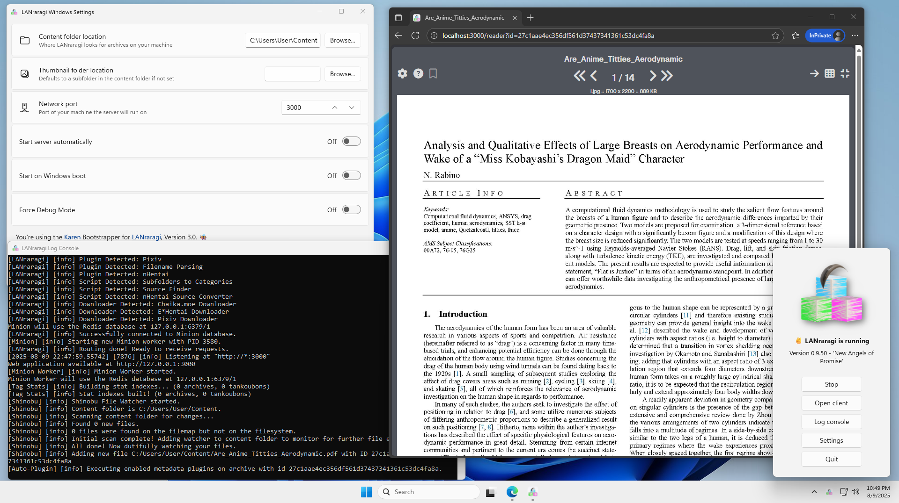

# ❓ Which installation method is best for me?

As LRR is a server app first and foremost, its setup is a bit more complex than your usual Desktop application.  
However, a lot of work as been done behind the scenes to make it easy!

Look at the methods below for something that fits your OS and usage.

## Linux/macOS: _Homebrew_

[Homebrew](https://brew.sh) allows you to quickly setup LRR on macOS and Linux without relying on containers or modifying your preinstalled system libaries.


[macos.md](macos.md)
 


While not a part of the main repo, you can check out the [Nix](community.md) package as well if brew isn't to your taste.


## Windows 10/11: _LRR for Windows_


This method works on **64-bit** editions of Windows 10 only.


I provide a dedicated installer for Windows machines as of 0.6.0, complete with a GUI and autostart.


[windows.md](windows.md)


## Linux/macOS/Windows 10: _Docker_

Taking a page from sysadmin books, you can easily install LRR as a **container** with Docker.  
They're lightweight, easy to update, and automatically built/tested. I recommend this for NAS setups!


[docker.md](docker.md)


## Linux/macOS: _Installing from Source_

Installing from **source** is a more involved procedure, but it does put you in full control and able to hack up the app's files as you wish.


[source.md](source.md)


## Linux/Community: _Community provided install packages_

Ready-to-install packages provided by voluntary maintainers or by a linux distribution itself.


[community.md](community.md)


## FreeBSD/Jail

Similar to installing from source with an altered process for FreeBSD compatability.


[jail.md](jail.md)


## Windows 7 or 8: don't

Switch to 10 or Linux.  
