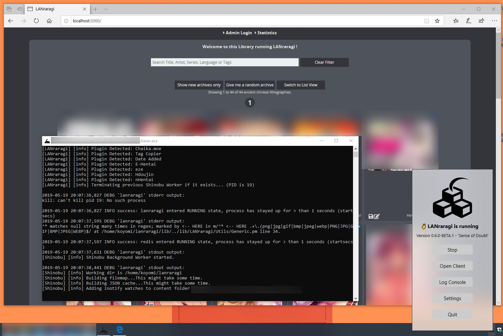

# Which installation method is best for me?

## Linux/macOS: _Docker or Source_

As LRR is a server app first and foremost, its setup is a bit more complex than your usual Desktop application.  
Therefore, for unexperienced users, I recommend using a **container** install with Docker.  
They're clean, easy to update, and automatically built/tested.



Installing from **source** is a more involved procedure, but it does put you in full control and able to hack up the app's files as you wish.



## Windows 10: _LRR for Windows_


This method works on **64-bit** editions of Windows 10 only. Versions under v1809 \(October 2018 Update\) will probably not work properly. v1803 _might_ work, but you're wading uncharted waters.




I provide a dedicated installer for Windows machines as of 0.6.0, complete with a GUI and autostart.



## Older Windows: _Legacy Docker Toolbox or Vagrant_


At this point the only solutions I have to give you are basically glorified VMs.

You can either download the [Legacy Docker Toolbox](https://docs.docker.com/toolbox/toolbox_install_windows/) and follow the Docker tutorial linked above, or try Vagrant. I provide **no support** for either of these methods.




I used to provide a Windows source port, but have encountered increasing issues with it as I introduced modern features and dependencies.

If you just want to try the software on old Windows machines, you can still use the old one-click Quickstarter for [v.0.5.6.](https://github.com/Difegue/LANraragi/releases/download/v.0.5.6/LRR_0.5.6_QuickStarter_Windows.zip) Run the .bat file and it should kinda just work.


## WARNING: Reverse Proxies

A common post-install setup is to make requests to the app transit through a gateway server such as Apache or nginx.  
If you do so, please note that archive uploads through LRR will likely **not work out of the box** due to maximum sizes on uploads those servers can enforce. The example below is for nginx:

```text
http {
    client_max_body_size 0;   <----------------------- This line here
}

server {
    listen 80;

    server_name lanraragi.[REDACTED].net;

    return 301 https://$host$request_uri;
}

server {
    listen 443 ssl;
    index index.php index.html index.htm;
    server_name lanraragi.[REDACTED].net;

    client_max_body_size 0;   <----------------------- And this line here

    # Cert Stuff Omitted

    location / {
        proxy_pass http://0.0.0.0:3000;
        proxy_http_version 1.1;
        <----- The two following lines are needed for batch tagger support with SSL ----->
        proxy_set_header Upgrade $http_upgrade; 
        proxy_set_header Connection $connection_upgrade;
    }
}
```

