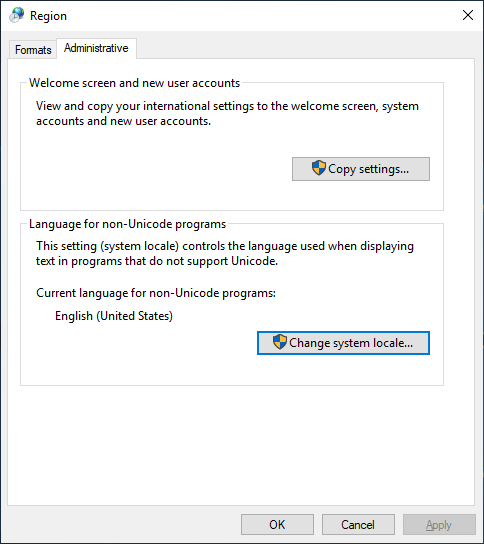

# 🪟 LRR for Windows (Win10)

## Download a Release

You can download the latest Windows MSI Installer on the [Release Page](https://github.com/Difegue/LANraragi/releases).

Windows 10 1809 is the minimum supported version. Windows 10 2004 and newer are recommended.


If you're using Windows 10 1809, UTF-8 support needs to be enabled. You can find instructions [here](#Mangled-filenames-when-running-on-Windows-10-1809).



Windows Nightlies are available [here](https://nightly.link/Difegue/LANraragi/workflows/push-continous-delivery/dev).


## Installation

Simply execute the installer package.

You might get a SmartScreen prompt from Windows (doesn't seem to happen with the Store) as the installer isn't signed; These are perfectly normal.  
(If you're wondering why I don't sign installers, [this](https://gaby.dev/posts/code-signing) article is a good read.)

Once the install completes properly, you'll be able to launch the GUI from the shortcut in your Start Menu:


## Configuration

Starting the GUI for the first time will prompt you to setup your content folder and the port you want the server to listen on. The main GUI is always available from your Taskbar.


You can also decide whether to start the GUI alongside Windows, or start LRR alongside the GUI. Combining the two makes it so that LANraragi starts alongside Windows. 🔥🔥🔥

## Usage


Once the program is running, you can open the Web Client through the shortcut button on the user interface. You can also toggle the Log Console on/off to see what's going on behind the scenes.

## Updating

Updates have to be done manually by downloading and running the latest installer.  

## Uninstallation

Simply uninstall the app from Windows Settings.  
Presto! Your database is not deleted in case you ever fancy coming back.

## Troubleshooting

### Installer failures

The tray GUI will show the error message it encountered instead of the LRR Version number if it fails to test the runtime - This might help you troubleshoot further. A detailed error can be found in the log console.

Some users reported that antivirus software can block the runtime install portion of the installer, so you might have some luck temporarily disabling it.

If you're still getting installer failures past that, try generating a full log of the installer:

```
msiexec /i "lanraragi.msi" /l*v "install.log"
```

and open a GitHub issue with it.

### Server isn't available on `localhost:3000` even though it has started properly

Running the application as Administrator might fix this in some instances.  
Otherwise, make sure the Windows Firewall isn't blocking any `perl` process.

### Mangled filenames when running on Windows 10 1809

This specific version of Windows 10 does not support per application UTF-8 so it needs to be enabled globally.

Run `intl.cpl` to open the Region settings, select the "Administrative" tab and click on "Change system locale..."



In the popup select the "Beta: Use Unicode UTF-8" option.


Restart and use the "Rescan content folder" button to fix existing paths.


