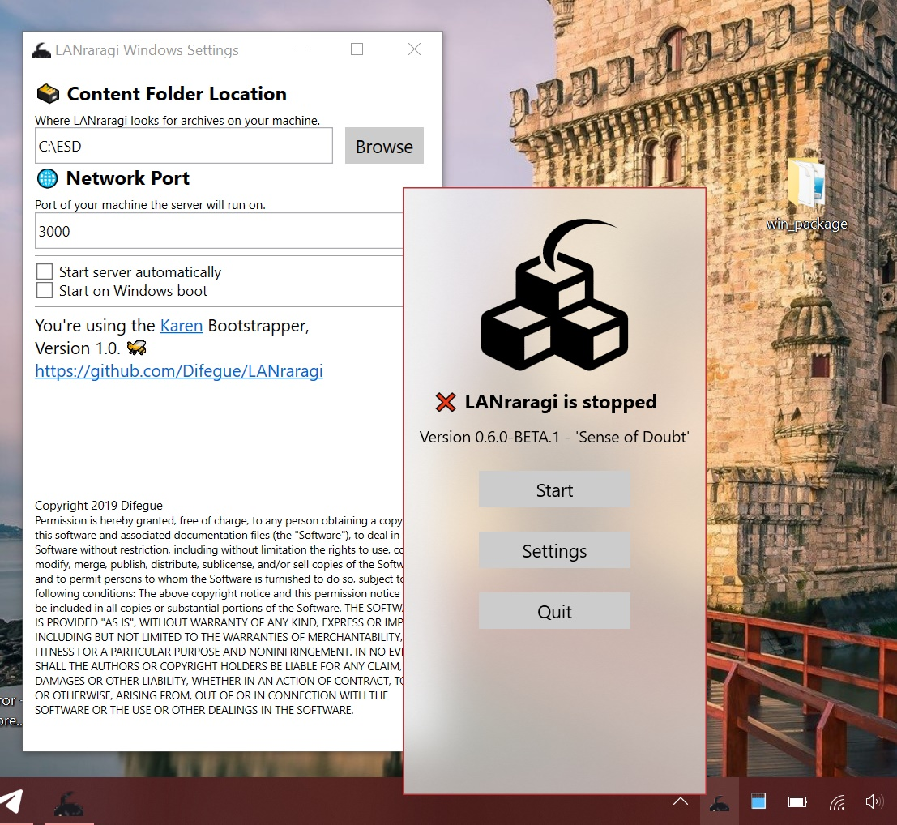

# LRR for Windows \(Win10\)

## Download a Release

You can download the latest Windows MSI Installer on the [Release Page](https://github.com/Difegue/LANraragi/releases), starting from 0.6.7.  


Prior to 0.6.7, Windows releases were available as .zips containing a PowerShell script installer.  

Windows Nightlies are available [here](https://mega.nz/#F!rHZynKpZ!ZXlwMam4t8VtYjOiHPONsQ).


## Installation

Simply execute the installer package. You should get a few security prompts from Windows as the installer isn't signed; These are perfectly normal.  
(If you're wondering why I don't sign installers, [this](https://gaby.dev/posts/code-signing) article is a good read.)  


The installer will tell you about this anyways, but LRR for Windows **requires** the Windows Subsystem for Linux to function properly.  
Read the tutorial [here](https://code.visualstudio.com/remote-tutorials/wsl/enable-wsl) to see how to enable WSL on your Windows 10 machine.  

You don't need to install a distribution through the Windows Store, as that is handled by the LRR installer package.


Once the install completes properly, you'll be able to launch the GUI from the shortcut in your Start Menu:

## Configuration

Starting the GUI for the first time will prompt you to setup your content folder and the port you want the server to listen on. The main GUI is always available from your Taskbar.

You can also decide whether to start the GUI alongside Windows, or start LRR alongside the GUI. Combining the two makes it so that LANraragi starts alongside Windows. 🔥🔥🔥


On Windows, VeraCrypt encrypted drives are known to not work properly as the content folder. See [https://github.com/Difegue/LANraragi/issues/182](https://github.com/Difegue/LANraragi/issues/182) for details.


## Usage

Once the program is running, you can open the Web Client through the shortcut button on the user interface. You can also toggle the Log Console on/off to see what's going on behind the scenes.

## Updating

Simply download the latest zip and re-run the installer script.

## Uninstallation

Simply execute the uninstaller shortcut left in your Start Menu.  
Presto! Your database is not deleted in case you ever fancy coming back.  

## Troubleshooting

If the installer fails, it's likely because it can't enable the Windows Subsystem for Linux \(WSL\) on your machine. Try running through the official Microsoft installation guide depicted[ here](https://docs.microsoft.com/en-us/windows/wsl/install-win10).

If WSL is installed properly but the tray GUI reports LANraragi as not being installed, try using the `wslconfig.exe /l` command and make sure the "lanraragi" distribution is present.

The tray GUI will show the error message it encountered instead of the LRR Version number if it fails to detect the distro - This might help you troubleshoot further.
