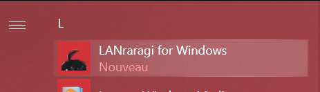

# LRR for Windows \(Win10\)

### Download a Release

You can download the latest Windows zip release on the [Release Page](https://github.com/Difegue/LANraragi/releases), starting from 0.6.0.


Windows Nightlies are available [here](https://mega.nz/#F!rHZynKpZ!ZXlwMam4t8VtYjOiHPONsQ).


After extracting the zip, you should have something like this:

### Installation

Right-click the install.ps1 script, and select **Run with PowerShell.** You should get a few security prompts from Windows as the script isn't signed; These are perfectly normal.  

Once the install completes properly, you'll be able to launch the GUI from the shortcut in your Start Menu:

You can delete the extracted zip if you want to from here onwards.

### Configuration

Starting the GUI for the first time will prompt you to setup your content folder and the port you want the server to listen on. The main GUI is always available from your Taskbar.

You can also decide whether to start the GUI alongside Windows, or start LRR alongside the GUI. Combining the two makes it so that LANraragi starts alongside Windows. 🔥🔥🔥

### Usage

Once the program is running, you can open the Web Client through the shortcut button on the user interface. You can also toggle the Log Console on/off to see what's going on behind the scenes.

### Updating

Simply download the latest zip and re-run the installer script.

### Uninstallation

Browse to the folder containing the GUI \(`%appdata%\LANraragi\Bootloader`\)and run the uninstallation script:

Presto! Your database is not deleted in case you ever fancy coming back.

### Troubleshooting

If the installer script fails, it's likely because it can't enable the Windows Subsystem for Linux \(WSL\) on your machine. Try running through the official Microsoft installation guide depicted[ here](https://docs.microsoft.com/en-us/windows/wsl/install-win10).

If WSL is installed properly but the tray GUI reports LANraragi as not being installed, try using the `wslconfig.exe /l` command and make sure the "lanraragi" distribution is present.

The tray GUI will show the error message it encountered instead of the LRR Version number if it fails to detect the distro - This might help you troubleshoot further.

