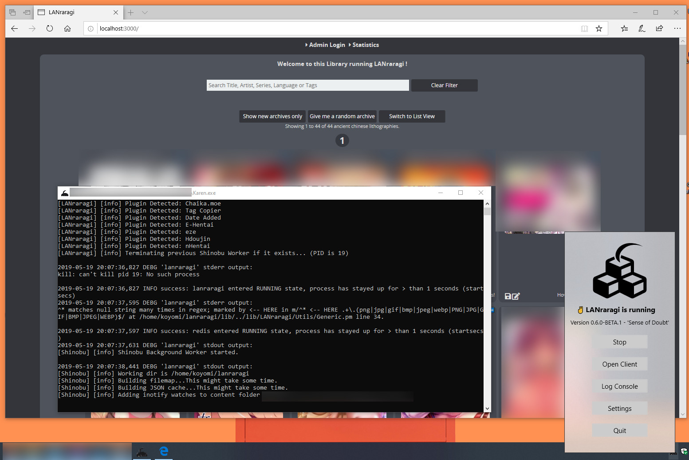

# 🐝 Karen

Windows Bootstrapper for LANraragi using WSL.  
Works on Windows 10 1809 and up. (1803 works but isn't recommended due to poor control on terminating Linux processes.)  
**64-bit OSes only!**  

* Start/Stop LRR from a Windows-based UI
* Show/hide log console on a click
* Options to set content folder and listen port

## Building

Add the WSL Distro package.tar in External/, alongside a LxRunOffline folder containing a version of LxRunOffline: https://github.com/DDoSolitary/LxRunOffline/releases

Then simply build the solution.  
